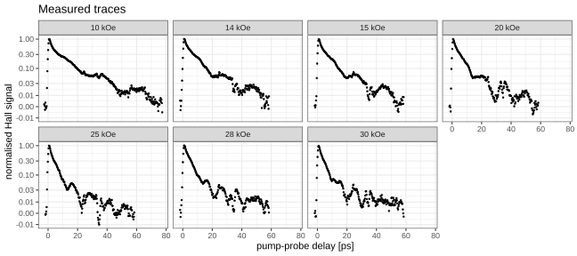
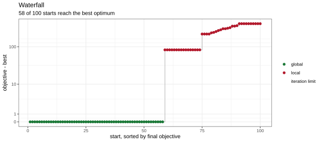
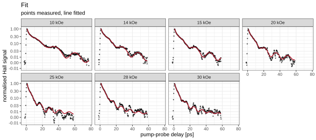
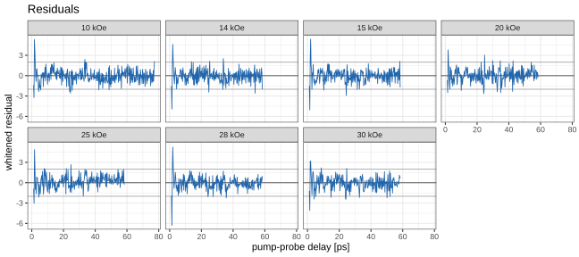
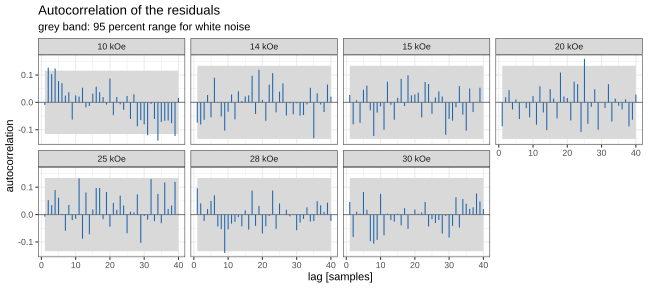

<!-- README.md is generated from README.Rmd. Please edit that file -->

# cppDE

<!-- badges: start -->

[](https://github.com/dModverse/cppDE/actions/workflows/R-CMD-check.yaml)
<!-- badges: end -->

**Automated C++ code generation for ODE integration with parameter
sensitivities.**

cppDE writes, compiles and runs a C++ solver for a system of ordinary
differential equations given as symbolic equations. First- and
second-order parameter sensitivities are computed in the same
integration by automatic differentiation.

## Features

- **Solvers**: variable-order BDF/NDF and Adams multistep in Nordsieck
  form, adapted from
  [SUNDIALS/CVODE](https://computing.llnl.gov/projects/sundials);
  Rosenbrock4 extended from
  [Boost.Odeint](https://www.boost.org/doc/libs/release/libs/numeric/odeint/);
  Tsit5, a 7-stage explicit FSAL Runge-Kutta with dense output
- **Sensitivities in both directions**: forward mode carries one
  direction per parameter through the solve, reverse mode contracts a
  seeded functional in one backward sweep at a cost independent of the
  parameter count
- **Second order**: exact Hessians, forward over forward or forward over
  reverse
- **Events**: time-based and root-triggered, with saltation corrections
  that keep first- and second-order sensitivities continuous across a
  jump
- **Symbolic Jacobian**, derived and compiled as analytic C++, with
  automatic sparsity detection and KLU factorisation for large systems
- **`cppFUN()`**: the same code generation for plain multivariate
  functions, with analytic Jacobian, Hessian and vector-Jacobian product
- **Batched solving**: `solveODEBatch()` integrates many conditions in
  one `.Call` over OpenMP threads, avoiding the fork and serialization a
  `parallel::mclapply()` loop pays per evaluation

## Installation

``` r
# install.packages("devtools")
devtools::install_github("dModverse/cppDE")
```

Model code is generated and compiled at run time, so a **C++17
compiler** and **Python with SymPy** are required. Windows users need
[Rtools](https://cran.r-project.org/bin/windows/Rtools/).

### Optional system dependencies

The package installs and runs without any system library. Three features
are gated on one, detected by `./configure` at install time:

| Feature | Needs | Without it |
|:---|:---|:---|
| `cvode()` backend | SUNDIALS (\>= 6.0) | the native solvers are unaffected |
| sparse Jacobian path | SuiteSparse / KLU | `sparse = TRUE` reports how to enable itself |
| parallel `solveODEBatch()` | a toolchain with OpenMP | correct results, conditions run serially |

They are independent: KLU is not part of SUNDIALS, and `cppODE()` calls
KLU without involving SUNDIALS at all. OpenMP needs nothing installed on
Linux or Rtools; on macOS, Apple’s clang needs `libomp`
(`brew install libomp`).

Either install the libraries as system packages,

| Platform | SUNDIALS | SuiteSparse / KLU |
|:---|:---|:---|
| Debian/Ubuntu | `sudo apt install libsundials-dev` | `sudo apt install libsuitesparse-dev` |
| Fedora | `sudo dnf install sundials-devel` | `sudo dnf install suitesparse-devel` |
| Arch | `sudo pacman -S sundials` | `sudo pacman -S suitesparse` |
| macOS (Homebrew) | `brew install sundials` | `brew install suite-sparse` |

or let cppDE build pinned releases into a per-user cache, which needs no
administrator rights:

``` r
cppDE::install_libs("sundials")        # or "suitesparse"
```

`./configure` scans that cache on every run, so the build is needed once
and later re-installs find it by themselves. See `?install_libs` for
building during the install itself, for build options, and for removing
the cache again. `CPPDE_EXTRA_CXXFLAGS` is appended to the flags of
every model `compile()`.

To see what was detected:

``` r
writeLines(readLines(system.file("cvodeConfig.dcf", package = "cppDE")))
```

## Fitting measured magnetisation dynamics

Fit of a Landau-Lifshitz-Gilbert model to the pump-probe measurements of
Zhang et al. (2025). cppDE integrates the model and its parameter
sensitivities. Likelihood, noise model and optimiser are R functions
from [`inst/examples/fitTools.R`](inst/examples/fitTools.R). The code
chunks are the sections of
[`inst/examples/example_fitCoPt.R`](inst/examples/example_fitCoPt.R).

### The experiment

|  |  |
|:---|:---|
| sample | \[Co (0.5 nm) / Pt (0.9 nm)\]<sub>5</sub>, perpendicular magnetic anisotropy |
| pump | 80 fs, 1500 nm |
| probe | anomalous Hall conductivity, read with a THz pulse, delays up to 80 ps |
| field | 1 to 3 T, seven values, about 30° from the film normal |

The signal rises within 0.5 ps (ultrafast demagnetisation) and recovers
within a few picoseconds. The recovery carries a precession at 40 to 100
GHz. The seven traces are fitted jointly.

``` r
library(cppDE)
library(ggplot2)
source(system.file("examples", "fitTools.R", package = "cppDE"))

theme_set(theme_bw(base_size = 11))
cores <- if (.Platform$OS.type == "windows") 1L else parallel::detectCores()
```

``` r
raw    <- read.csv(system.file("extdata", "zhang2025_precession.csv",
                               package = "cppDE"))
fields <- sort(unique(raw$field_kOe))

## The first picosecond (ultrafast demagnetisation) is not described by the
## model and is left out of the fit.
obs      <- lapply(split(raw, raw$field_kOe), function(tr) tr[tr$time_ps >= 1, ])
measured <- do.call(rbind, obs)
kOe      <- as_labeller(function(x) paste(x, "kOe"))

## y axis linear near zero and logarithmic above.
signalAxis <- scale_y_continuous(
  trans  = scales::pseudo_log_trans(sigma = 0.005, base = 10),
  breaks = c(-0.01, 0, 0.01, 0.03, 0.1, 0.3, 1))

print(
  ggplot(raw, aes(time_ps, signal)) +
    geom_point(size = 0.5) +
    signalAxis +
    facet_wrap(~field_kOe, ncol = 4, labeller = kOe) +
    labs(x = "pump-probe delay [ps]", y = "normalised Hall signal",
         title = "Measured traces")
)
```



### Model

The magnetisation direction $\mathbf m$, $|\mathbf m| = 1$, follows the
Landau-Lifshitz-Gilbert equation in Landau-Lifshitz form,

$$\dot{\mathbf m} = -\frac{\gamma}{1+\alpha^2}
\left[\mathbf m\times\mathbf h + \alpha\,\mathbf m\times(\mathbf m\times\mathbf h)\right],
\qquad \gamma = \frac{g\,\mu_B}{\hbar},$$

with Gilbert damping $\alpha$ and g-factor $g$. The effective field is
the applied field, tilted by $\phi$ from the normal $\hat{\mathbf z}$,
plus the perpendicular anisotropy field $H_a$,

$$\mathbf h = H\,(\sin\phi,\,0,\,\cos\phi) + H_a\,\bigl(1 - k(t)\bigr)\,m_z\,\hat{\mathbf z}.$$

Heating lowers the anisotropy field by the fraction
$k(t) = K\,\kappa(t)$, $\kappa(0) = 1$, which decays as
$\dot\kappa = -\kappa/\tau_K$.

Before the pump, $\mathbf m$ rests at
$\mathbf m_0 = (\sin\theta_0, 0, \cos\theta_0)$, where the torque
vanishes,

$$H\sin(\theta_0-\phi) + H_a\sin\theta_0\cos\theta_0 = 0 ,$$

and the field there is parallel to $\mathbf m_0$,
$\mathbf h(\mathbf m_0) = \lambda\,\mathbf m_0$ with
$\lambda = H\cos(\theta_0-\phi) + H_a\cos^2\theta_0$. The drop of $H_a$
moves the equilibrium; $\mathbf m$ precesses about it while $H_a$
recovers.

The deviation from $\mathbf m_0$ is of order $K$, and the states of the
model are $\boldsymbol\xi = (\mathbf m - \mathbf m_0)/K$ and $\kappa$.
Because $\mathbf m_0\times\mathbf h(\mathbf m_0) = 0$, the right-hand
side in these states is a polynomial in $K$ without a constant term. The
equations hold for any $K$, and $K\to 0$ gives the linearised dynamics.
This avoids computing $m_{z0} - m_z$ as a difference of nearly equal
numbers.

``` r
muB <- 8.794e-5                      # mu_B / hbar in rad / (ps mT)

## LLG, m' = -g (m x h + alpha m x (m x h)), g = g-factor mu_B / hbar /
## (1 + alpha^2), field h = H (sin phi, 0, cos phi) + Ha (1 - K kappa) mz z.
## States xi = (m - m0) / K and kappa, with the equilibrium
## m0 = (sin th, 0, cos th). Since h(m0) = lam m0, the right-hand side is a
## polynomial in K without constant term. Positive parameters enter as log10.
a   <- "(10^log10Alpha)"
g   <- sprintf("(%g*10^log10G/(1 + %s^2))", muB, a)
xm  <- "(xi_x*sin(th) + xi_z*cos(th))"                  # xi . m0
xx  <- "(xi_x^2 + xi_y^2 + xi_z^2)"                     # xi . xi
eta <- "(10^log10Ha*(xi_z - kap*(cos(th) + K*xi_z)))"   # (h - lam m0) / K, z
a1  <- sprintf("(lam*%s + %s*cos(th))", xm, eta)
a2  <- sprintf("(%s*xi_z)", eta)
b1  <- sprintf("(2*%s)", xm)
b2  <- xx

## m x h / K
cx <- sprintf("(lam*xi_y*cos(th) + K*%s*xi_y)", eta)
cy <- sprintf("(lam*(xi_z*sin(th) - xi_x*cos(th)) - %s*sin(th) - K*%s*xi_x)",
              eta, eta)
cz <- "(-lam*xi_y*sin(th))"

## (m (m.h) - h (m.m)) / K
dx <- sprintf(paste0("(lam*xi_x + sin(th)*%s - lam*sin(th)*%s",
                     " + K*(xi_x*%s + sin(th)*%s - lam*sin(th)*%s)",
                     " + K^2*xi_x*%s)"),
              a1, b1, a1, a2, b2, a2)
dy <- sprintf("(lam*xi_y + K*xi_y*%s + K^2*xi_y*%s)", a1, a2)
dz <- sprintf(paste0("(lam*xi_z + cos(th)*%s - %s - lam*cos(th)*%s",
                     " + K*(xi_z*%s + cos(th)*%s - %s*%s - lam*cos(th)*%s)",
                     " + K^2*(xi_z*%s - %s*%s))"),
              a1, eta, b1, a1, a2, eta, b1, b2, a2, eta, b2)

llg <- c(
  xi_x = sprintf("-%s*(%s + %s*%s)", g, cx, a, dx),
  xi_y = sprintf("-%s*(%s + %s*%s)", g, cy, a, dy),
  xi_z = sprintf("-%s*(%s + %s*%s)", g, cz, a, dz),
  kap  = "-kap*10^(-log10TauK)"
)

## Initial states xi = 0 and kappa = 1 are not estimated. H and phi enter only
## through th and lam.
model <- cppODE(llg, fixed = c("xi_x", "xi_y", "xi_z", "kap"),
                modelname = "copt_precession", method = "bdf", deriv = TRUE)
#> using C++ compiler: g++ [-O2 -DNDEBUG -w -fPIC -fopenmp]
```

### Observable, sensitivities and noise

The anomalous Hall conductivity is proportional to the out-of-plane
magnetisation. The recovery of the demagnetisation is not part of the
model and is described per measurement by two exponentials:

$$y(t) = A_1 e^{-t/\tau_1} + A_2 e^{-t/\tau_2} + S\,\bigl[m_{z0} - m_z(t)\bigr]
     = A_1 e^{-t/\tau_1} + A_2 e^{-t/\tau_2} - S\,K\,\xi_z(t).$$

$\alpha$, $g$, $H_a$, $\tau_K$, $S$, $K$ and $\phi$ are shared by all
fields; background and noise level are per measurement. $H$ is the set
field value; $\mu_B/\hbar$ is the only fixed constant.

cppDE returns $\partial\boldsymbol\xi/\partial p$ for the parameters of
the model. $\theta_0$ and $\lambda$ depend on $H_a$ and $\phi$; the
implicit function theorem gives

$$\frac{\partial\theta_0}{\partial H_a} = -\frac{\sin\theta_0\cos\theta_0}{D},\qquad
\frac{\partial\theta_0}{\partial\phi} = \frac{H\cos(\theta_0-\phi)}{D},\qquad
D = H\cos(\theta_0-\phi) + H_a\cos 2\theta_0 ,$$

and the chain rule gives the sensitivities with respect to $H_a$ and
$\phi$. No finite differences are used.

The autocorrelation of the residuals decays within five samples, about
one picosecond. The noise is modelled as a moving average (Box et
al. 2015),

$$u_t = \eta_t + \sum_{j=1}^{5} w_j\,\eta_{t-j},\qquad \eta_t\sim\mathcal N(0,\sigma^2),$$

with the kernel $w$ shared by all measurements and $\sigma$ per
measurement. Correlations beyond five samples are zero, so the noise
model cannot describe the precession. The likelihood is the conditional
sum of squares of the innovations $\eta_t$; the $\log\sigma$ term enters
as a pseudo-residual, which keeps the problem least squares.

``` r
## Equilibrium before the pump: H sin(th - phi) + Ha sin(th) cos(th) = 0 and
## lam = H cos(th - phi) + Ha cos(th)^2. Derivatives of th and lam with respect
## to Ha and phi from the implicit function theorem.
equilibrium <- function(Ha, H, phi) {
  torque <- function(th) H * sin(th - phi) + Ha * sin(th) * cos(th)
  th     <- uniroot(torque, c(0, phi), tol = 1e-12 * phi)$root
  sc     <- sin(th) * cos(th)
  den    <- H * cos(th - phi) + Ha * cos(2 * th)
  thHa   <- -sc / den
  thPhi  <- H * cos(th - phi) / den
  list(theta = th,
       lam   = H * cos(th - phi) + Ha * cos(th)^2,
       dHa   = c(th = thHa,  lam = cos(th)^2 - Ha * sc * thHa),
       dPhi  = c(th = thPhi, lam = H * sin(th - phi) - Ha * sc * thPhi))
}

## Signal: two-exponential background plus S (mz0 - mz) = -S K xi_z. Physics
## parameters and noise kernel are shared by all fields, background and noise
## level are per field. Positive parameters are fitted as log10, K and
## phi / 90 deg as log10(x / (1 - x)).
physics   <- c("log10Alpha", "log10G", "log10Ha", "log10TauK", "log10S",
               "logit10K", "logit10Phi")
kernel    <- paste0("w", 1:5)
bgNames   <- function(f) paste0(c("log10A1_", "log10Tau1_", "log10A2_",
                                  "log10Tau2_"), f)
sigmaName <- function(f) paste0("logSigma_", f)
ln10      <- log(10)

traceSignal <- function(p, k, tt) {
  H   <- 100 * fields[k]
  bn  <- bgNames(fields[k])
  K   <- toNatural("logit10K", p[["logit10K"]])
  S   <- 10^p[["log10S"]]
  Ha  <- 10^p[["log10Ha"]]
  u   <- toNatural("logit10Phi", p[["logit10Phi"]])
  phi <- pi / 2 * u                          # between 0 and 90 degrees
  eqm <- equilibrium(Ha, H, phi)
  pars <- c(xi_x = 0, xi_y = 0, xi_z = 0, kap = 1, K = K, th = eqm$theta,
            lam = eqm$lam, p[c("log10Alpha", "log10G", "log10Ha", "log10TauK")])
  sol <- tryCatch(solveODE(model, c(0, tt), pars, abstol = 1e-9, reltol = 1e-9),
                  error = function(e) NULL)
  if (is.null(sol)) return(NULL)

  xi      <- sol$variable[-1, "xi_z"]
  dxi     <- sol$tangent[-1, "xi_z", , drop = TRUE]
  viaRest <- function(d) dxi[, "th"] * d[["th"]] + dxi[, "lam"] * d[["lam"]]
  prec    <- -S * K * xi
  T1 <- 10^p[[bn[2]]]
  T2 <- 10^p[[bn[4]]]
  e1 <- 10^p[[bn[1]]] * exp(-tt / T1)
  e2 <- 10^p[[bn[3]]] * exp(-tt / T2)

  J <- matrix(0, length(tt), length(p), dimnames = list(NULL, names(p)))
  J[, "log10Alpha"] <- -S * K * dxi[, "log10Alpha"]
  J[, "log10G"]     <- -S * K * dxi[, "log10G"]
  J[, "log10Ha"]    <- -S * K * (dxi[, "log10Ha"] + ln10 * Ha * viaRest(eqm$dHa))
  J[, "log10TauK"]  <- -S * K * dxi[, "log10TauK"]
  J[, "log10S"]     <-  ln10 * prec
  J[, "logit10K"]   <- -S * (xi + K * dxi[, "K"]) * ln10 * K * (1 - K)
  J[, "logit10Phi"] <- -S * K * viaRest(eqm$dPhi) * pi / 2 * ln10 * u * (1 - u)
  J[, bn[1]] <- ln10 * e1
  J[, bn[2]] <- ln10 * e1 * tt / T1
  J[, bn[3]] <- ln10 * e2
  J[, bn[4]] <- ln10 * e2 * tt / T2
  list(y = e1 + e2 + prec, J = J)
}

## Noise: moving average of order 5, the lag at which the autocorrelation of
## the residuals decays. Kernel and noise levels are estimated. `innovations`
## are the whitened residuals. Moving-average models and the conditional sum
## of squares: Box, Jenkins, Reinsel, Ljung, Time Series Analysis, 5th ed.,
## Wiley (2015).
likelihood <- function(p) {
  r <- J <- innovations <- vector("list", length(fields))
  for (k in seq_along(fields)) {
    part <- traceSignal(p, k, obs[[k]]$time_ps)
    if (is.null(part)) return(NULL)
    sn <- sigmaName(fields[k])
    z  <- maResiduals(part$y - obs[[k]]$signal, part$J, p[[sn]], p[kernel])
    if (is.null(z)) return(NULL)
    z$J[, sn]     <- z$dSigma
    z$J[, kernel] <- z$dW
    r[[k]] <- z$r
    J[[k]] <- z$J
    innovations[[k]] <- z$r[seq_along(part$y)]
  }
  list(r = unlist(r), J = do.call(rbind, J),
       innovations = setNames(innovations, paste(fields, "kOe")))
}

## Gaussian prior on the physics parameters, standard deviation 3 decades,
## centred on order-of-magnitude values and the nominal field angle.
priorSd   <- 3
prior     <- c(log10Alpha = -1, log10G = log10(2), log10Ha = 3,
               log10TauK = log10(30), log10S = 0, logit10K = 0,
               logit10Phi = log10(0.5))
residuals <- withPrior(likelihood, prior, priorSd)
```

### Fit

Gauss-Newton on a trust region with exact subproblem (More-Sorensen),
from 100 random starts. Positive parameters are fitted as $\log_{10}$,
the fractions $K$ and $\phi/90^\circ$ as $\log_{10}\bigl(x/(1-x)\bigr)$,
so one unit is one decade. The physics parameters carry a Gaussian prior
with a standard deviation of three decades, centred on orders of
magnitude and the nominal field angle.

``` r
set.seed(2)
nStart <- 100
perTrace <- do.call(cbind, lapply(fields, function(f) {
  tail <- obs[[as.character(f)]]$signal[obs[[as.character(f)]]$time_ps > 30]
  m <- cbind(runif(nStart, log10(0.3),  log10(3)),
             runif(nStart, log10(0.5),  log10(5)),
             runif(nStart, log10(0.05), log10(2)),
             runif(nStart, log10(2),    log10(30)),
             log(sd(diff(tail))) + runif(nStart, -0.5, 0.5))
  colnames(m) <- c(bgNames(f), sigmaName(f))
  m
}))

## Geometrically decaying kernels are invertible, so every start can be
## whitened.
decay <- runif(nStart, 0.2, 0.8)
kernelStarts <- outer(decay, seq_along(kernel), `^`)
colnames(kernelStarts) <- kernel
phiStart <- runif(nStart, 10, 60) / 90
starts <- cbind(log10Alpha = runif(nStart, log10(0.005), 0),
                log10G     = runif(nStart, log10(1.5),   log10(3)),
                log10Ha    = runif(nStart, 2,            log10(5000)),
                log10TauK  = runif(nStart, log10(2),     log10(500)),
                log10S     = runif(nStart, -1,           log10(50)),
                logit10K   = runif(nStart, -2, 1),
                logit10Phi = log10(phiStart / (1 - phiStart)),
                kernelStarts, perTrace)

ms <- multistart(residuals, starts, cores)

print(table(ms$status))
#> 
#> global  local 
#>     58     42
print(plotWaterfall(ms))
```



``` r

fit <- ms$best
```

``` r
fitted <- do.call(rbind, lapply(seq_along(fields), function(k) {
  tt <- seq(1, max(obs[[k]]$time_ps), length.out = 400)
  data.frame(field_kOe = fields[k], time_ps = tt,
             signal = traceSignal(fit$par, k, tt)$y)
}))

print(
  ggplot(raw, aes(time_ps, signal)) +
    geom_point(size = 0.5, alpha = 0.6) +
    geom_line(data = fitted, colour = "#b2182b", linewidth = 0.7) +
    signalAxis +
    facet_wrap(~field_kOe, ncol = 4, labeller = kOe) +
    labs(x = "pump-probe delay [ps]", y = "normalised Hall signal",
         title = "Fit", subtitle = "points measured, line fitted")
)
```



``` r

## Whitened residuals, Ljung-Box test (Ljung, Box, Biometrika 65, 297, 1978)
## and autocorrelation.
res <- likelihood(fit$par)$innovations

print(
  ggplot(data.frame(field_kOe = measured$field_kOe, time_ps = measured$time_ps,
                    r = unlist(res)),
         aes(time_ps, r)) +
    geom_hline(yintercept = c(-2, 2), colour = "grey70") +
    geom_hline(yintercept = 0, colour = "grey40") +
    geom_line(colour = "#2166ac", linewidth = 0.4) +
    facet_wrap(~field_kOe, ncol = 4, labeller = kOe) +
    labs(x = "pump-probe delay [ps]", y = "whitened residual",
         title = "Residuals")
)
```



``` r

print(signif(residualCheck(res), 3))
#>          n chi2_per_point     lag1 LjungBox      p
#> 10 kOe 286              1 -0.00928    17.40 0.0654
#> 14 kOe 215              1 -0.07440     9.44 0.4910
#> 15 kOe 215              1  0.02710     8.08 0.6210
#> 20 kOe 215              1 -0.08720     4.09 0.9430
#> 25 kOe 215              1 -0.00731     4.72 0.9090
#> 28 kOe 215              1  0.09600    10.40 0.4030
#> 30 kOe 215              1  0.04600    11.40 0.3270
print(plotResidualACF(res))
```



``` r

labels <- c(log10Alpha = "alpha", log10G = "g", log10Ha = "Ha [mT]",
            log10TauK = "tauK [ps]", log10S = "S", logit10K = "anisotropy drop",
            logit10Phi = "phi / 90 deg")
estimates <- natural(fit$par[physics])
names(estimates) <- labels[physics]
print(signif(estimates, 4))
#>           alpha               g         Ha [mT]       tauK [ps]               S 
#>         0.09411         2.10600       414.50000        39.06000       329.20000 
#> anisotropy drop    phi / 90 deg 
#>         0.01983         0.13470

noiseLevel <- setNames(exp(fit$par[sigmaName(fields)]), paste(fields, "kOe"))
print(signif(noiseLevel, 3))
#>  10 kOe  14 kOe  15 kOe  20 kOe  25 kOe  28 kOe  30 kOe 
#> 0.00323 0.00470 0.00341 0.00356 0.00330 0.00434 0.00386
print(signif(fit$par[kernel], 3))
#>    w1    w2    w3    w4    w5 
#> 0.967 0.708 0.444 0.256 0.136
```

The innovations pass the Ljung-Box test (Ljung and Box 1978). For small
precession amplitudes $S$, $K$ and $\phi$ enter essentially as a product
and are not determined individually.

Small-angle precession frequency about the equilibrium (Smit-Beljers)
against the frequencies obtained in the paper from damped-sine fits:

``` r
## Small-angle precession frequency (Smit-Beljers) from the fitted parameters,
## compared with the frequencies from damped-sine fits in the paper.
fmr <- function(H, Ha, alpha, g, phi) {
  th <- equilibrium(Ha, H, phi)$theta
  w  <- g * muB * sqrt((H * cos(th - phi) + Ha * cos(2 * th)) * H * sin(phi) / sin(th))
  1000 * w / (2 * pi * (1 + alpha^2))
}
paper <- read.csv(system.file("extdata", "zhang2025_frequencies.csv",
                              package = "cppDE"))
paper$model_GHz <- sapply(100 * paper$field_kOe, fmr,
                          Ha    = estimates[["Ha [mT]"]],
                          alpha = estimates[["alpha"]],
                          g     = estimates[["g"]],
                          phi   = pi / 2 * estimates[["phi / 90 deg"]])
print(paper)
#>   field_kOe frequency_GHz model_GHz
#> 1        10        39.494  40.85750
#> 2        14        53.890  52.47403
#> 3        15        53.866  55.38219
#> 4        20        70.713  69.93806
#> 5        25        86.335  84.51017
#> 6        28        97.438  93.25826
#> 7        30       102.080  99.09177
```

Data: measured traces of Fig. 3 in Z. Zhang, Y. Shiota, S. Karube, Y.
Watanabe, T. Ono and H. Hirori, [Phys. Rev. Applied **24**, 044079
(2025)](https://doi.org/10.1103/4p39-gyrd), published under CC BY 4.0 in
[doi:10.5281/zenodo.17333041](https://doi.org/10.5281/zenodo.17333041);
see [`inst/COPYRIGHTS`](inst/COPYRIGHTS).

Noise model: G. E. P. Box, G. M. Jenkins, G. C. Reinsel and G. M. Ljung,
*Time Series Analysis: Forecasting and Control*, 5th ed. (Wiley, 2015).
G. M. Ljung and G. E. P. Box, *On a measure of lack of fit in time
series models*, [Biometrika **65**, 297
(1978)](https://doi.org/10.1093/biomet/65.2.297).

## License

cppDE is distributed under the **MIT License**; see `LICENSE` /
`LICENSE.md` for the full text.

Portions of the C++ solver core in `inst/include/cppde/` are derived
from third-party projects and remain subject to their upstream licenses:

- The Nordsieck multistep stepper (BDF/NDF and Adams-Moulton) in
  `cppde_multistepper.hpp`, `cppde_multistepper_controller.hpp` and
  `cppde_newton.hpp` is a port of the corresponding routines in
  [SUNDIALS/CVODE(S)](https://computing.llnl.gov/projects/sundials)
  (Copyright © 2002-2024 Lawrence Livermore National Security and
  Southern Methodist University), distributed under the **BSD-3-Clause**
  license.
- The Rosenbrock4 stepper architecture in `cppde_rosenbrock4.hpp` (and
  the surrounding stage-matrix, dense-output and stepper-protocol
  infrastructure) is derived from
  [Boost.Numeric.Odeint](https://www.boost.org/doc/libs/release/libs/numeric/odeint/)
  by Karsten Ahnert, Mario Mulansky and Christoph Koke, distributed
  under the **Boost Software License 1.0**.

Full upstream copyright notices and license texts are reproduced in
[`inst/COPYRIGHTS`](inst/COPYRIGHTS). Both upstream licenses are
permissive and compatible with MIT; using or redistributing cppDE
requires preserving the notices in `inst/COPYRIGHTS` and the relevant
header attribution blocks.

The optional system libraries linked at run time are not vendored:
SUNDIALS (BSD-3-Clause) for the `cvode()` backend and SuiteSparse-KLU
(LGPL-2.1+) for the sparse-Jacobian path. Their own licenses govern the
libraries at the user’s installation site.
